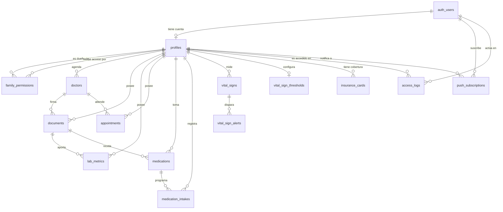

# Modelo de datos — Historial Médico

> Fuente de verdad: `supabase/migrations/20260812200000_schema_inicial.sql`.
> Este documento explica **qué relaciona con qué** y **por qué se modeló así**. Si el SQL y este documento se contradicen, gana el SQL y este archivo se corrige.

- **Motor:** PostgreSQL 15+ (Supabase), esquema `public`, encoding UTF-8.
- **Alcance de la migración inicial:** 8 enums, 2 funciones de trigger, 12 tablas, 30 índices, 10 triggers.
- **Fuera de alcance de la migración inicial (a propósito):** RLS y políticas, buckets de Storage, vistas de cálculo y jobs de `pg_cron`. Ver [Qué queda para migraciones futuras](#qué-queda-para-migraciones-futuras). **RLS ya no está pendiente:** se aplicó en `20260812220000_rls.sql` y está documentada en [`seguridad-rls.md`](./seguridad-rls.md).

---

## 1. Mapa de relaciones

Cardinalidad leída como *origen → destino*.

```
auth.users (Supabase Auth)
    │
    │ 1 ─── 0..1   (profiles.user_id UNIQUE y NULLABLE)
    ▼
profiles ◄──────────────────────────────────────────────────────────┐
    │                                                               │
    │ 1 ─── 0..N   family_permissions.owner_profile_id              │
    ├──────────────────────────────────────────────────► family_permissions
    │ 1 ─── 0..N   family_permissions.granted_profile_id ───────────┘
    │
    │ 1 ─── 0..N   doctors.profile_id
    ├──────────────────────────────────────────────────► doctors
    │                                                        │
    │ 1 ─── 0..N   documents.profile_id                       │ 0..1 ─── 0..N
    ├──────────────────────────────────────────────────► documents ◄──┘
    │                                                        │      (documents.doctor_id)
    │                                                        │ 1 ─── 0..N
    │                                                        ▼
    │ 1 ─── 0..N   lab_metrics.profile_id               lab_metrics
    ├──────────────────────────────────────────────────►      ▲
    │                                                         │ (lab_metrics.document_id, NULLABLE)
    │ 1 ─── 0..N   appointments.profile_id
    ├──────────────────────────────────────────────────► appointments ◄─── doctors (appointments.doctor_id, 0..1)
    │
    │ 1 ─── 0..N   medications.profile_id
    ├──────────────────────────────────────────────────► medications ◄─── documents
    │                                                        │       (medications.prescription_document_id, 0..1)
    │                                                        │ 1 ─── 0..N
    │ 1 ─── 0..N   medication_intakes.profile_id              ▼
    ├──────────────────────────────────────────────────► medication_intakes
    │
    │ 1 ─── 0..N   vital_signs.profile_id
    ├──────────────────────────────────────────────────► vital_signs
    │                                                        │ 1 ─── 0..N
    │ 1 ─── 0..1   vital_sign_thresholds.profile_id (PK)      ▼
    ├──────────────────────────────────────────────────► vital_sign_alerts
    │                                                   (vital_sign_alerts.profile_id, sellado)
    │
    │ 1 ─── 0..N   insurance_cards.profile_id
    ├──────────────────────────────────────────────────► insurance_cards
    │
    │ 1 ─── 0..N   access_logs.profile_id  +  access_logs.actor_profile_id
    ├──────────────────────────────────────────────────► access_logs ◄─── auth.users (actor_user_id, 0..1)
    │
    │ 0..1 ─── 0..N   push_subscriptions.profile_id
    └──────────────────────────────────────────────────► push_subscriptions ◄─── auth.users (user_id, 1)
```

### Tabla de relaciones

| Origen | Columna | Destino | Cardinalidad | ON DELETE | Por qué |
|---|---|---|---|---|---|
| `profiles` | `user_id` | `auth.users` | 0..1 → 1 | `CASCADE` | Nullable: perfil gestionado sin cuenta. `UNIQUE`: una cuenta = un perfil propio |
| `family_permissions` | `owner_profile_id` | `profiles` | N → 1 | `CASCADE` | Sin dueño el permiso no tiene sentido |
| `family_permissions` | `granted_profile_id` | `profiles` | N → 1 | `CASCADE` | Ídem para el destinatario del acceso |
| `doctors` | `profile_id` | `profiles` | N → 1 | `CASCADE` | Cada perfil tiene su propia agenda |
| `documents` | `profile_id` | `profiles` | N → 1 | `CASCADE` | El historial se borra con la persona |
| `documents` | `doctor_id` | `doctors` | N → 0..1 | `SET NULL` | Depurar un médico no puede borrar un estudio |
| `lab_metrics` | `profile_id` | `profiles` | N → 1 | `CASCADE` | — |
| `lab_metrics` | `document_id` | `documents` | N → 0..1 | `CASCADE` | Nullable para métricas cargadas a mano |
| `appointments` | `profile_id` | `profiles` | N → 1 | `CASCADE` | — |
| `appointments` | `doctor_id` | `doctors` | N → 0..1 | `SET NULL` | El turno sobrevive con `doctor_name` textual |
| `medications` | `profile_id` | `profiles` | N → 1 | `CASCADE` | — |
| `medications` | `prescription_document_id` | `documents` | N → 0..1 | `SET NULL` | Borrar la receta no borra el tratamiento |
| `medication_intakes` | `medication_id` | `medications` | N → 1 | `CASCADE` | La toma no existe sin su medicación |
| `medication_intakes` | `profile_id` | `profiles` | N → 1 | `CASCADE` | Desnormalizado (ver decisión 6) |
| `vital_signs` | `profile_id` | `profiles` | N → 1 | `CASCADE` | — |
| `vital_sign_thresholds` | `profile_id` | `profiles` | 0..1 → 1 | `CASCADE` | Es también la PK: como mucho una fila de umbrales por perfil (ver [`modelo-signos.md`](./modelo-signos.md) §3) |
| `vital_sign_alerts` | `vital_sign_id` | `vital_signs` | N → 1 | `CASCADE` | Una alerta sin su medición no tiene referente |
| `vital_sign_alerts` | `profile_id` | `profiles` | N → 1 | `CASCADE` | Desnormalizado y **sellado por trigger** desde la medición: es la columna que resuelve la política de lectura |
| `vital_sign_alerts` | `acknowledged_by` | `profiles` | N → 0..1 | `SET NULL` | El rastro de que alguien la atendió sobrevive al borrado de ese perfil |
| `insurance_cards` | `profile_id` | `profiles` | N → 1 | `CASCADE` | — |
| `access_logs` | `actor_user_id` | `auth.users` | N → 0..1 | `SET NULL` | El rastro sobrevive al borrado de la cuenta |
| `access_logs` | `actor_profile_id` | `profiles` | N → 0..1 | `SET NULL` | Ídem |
| `access_logs` | `profile_id` | `profiles` | N → 0..1 | `SET NULL` | Ídem, y respeta el derecho de supresión |
| `access_logs` | `resource_id` | *(sin FK)* | — | — | Debe sobrevivir al borrado del recurso auditado |
| `push_subscriptions` | `user_id` | `auth.users` | N → 1 | `CASCADE` | Sin cuenta no hay push |
| `push_subscriptions` | `profile_id` | `profiles` | N → 0..1 | `CASCADE` | Perfil activo al suscribirse (ver decisión 9) |
| `health_centers` | *(sin FK)* | — | — | — | **Tabla sin dueño**: catálogo público del Estado, igual para todas las familias (ver decisión 14) |
| `health_centers_sync` | `run_started_by` | `auth.users` | 0..1 → 0..1 | `SET NULL` | Auditoría de quién apretó "Actualizar"; el registro sobrevive a la baja de la cuenta |

### Diagrama ER



---

## 2. Enums

| Enum | Valores | Usado en |
|---|---|---|
| `user_role` | `admin`, `elder`, `family_member`, `caregiver` | `profiles.role` |
| `doc_category` | `laboratory`, `imaging`, `prescription`, `consultation`, `other` | `documents.category` |
| `appointment_status` | `pending`, `confirmed`, `completed`, `cancelled` | `appointments.status` |
| `vital_sign_type` | `blood_pressure`, `glucose`, `weight` | `vital_signs.type`, `vital_sign_alerts.tipo` |
| `vital_sign_alert_rule` ⁺ | `sistolica_alta`, `diastolica_alta`, `glucemia_baja`, `glucemia_alta`, `peso_variacion` | `vital_sign_alerts.regla` (agregado en `20260814080000`) |
| `insurance_card_side` | `front`, `back` | Capa de aplicación (ver decisión 8) |
| `medication_frequency` | `daily`, `interval_hours`, `as_needed` | `medications.frequency` |
| `medication_intake_status` | `pending`, `taken`, `skipped`, `missed` | `medication_intakes.status` |
| `access_action` | `login`, `logout`, `ver_perfil`, `ver_documento`, `descargar_archivo`, `ver_credencial`, `exportar_ficha`, `otorgar_permiso`, `revocar_permiso` | `access_logs.action` |

Los identificadores de tablas y columnas están en inglés; los literales de `access_action` están en español porque son los que fija el ROADMAP para la vista de accesos del titular (Sprint 2) y los que se muestran textualmente al usuario.

---

## 3. Decisiones de modelado

### 1. `profiles.user_id` es NULL a propósito

Es la pieza que habilita todo el producto: un adulto mayor puede tener historial en la app **sin cuenta propia** en Supabase Auth. El perfil existe, lo administra un familiar vía `family_permissions`, y `user_id` queda en `NULL`.

- `NULL` → perfil **gestionado** (no puede iniciar sesión).
- `uuid` → perfil **con cuenta** (inicia sesión y ve sus propios datos).
- La columna tiene `UNIQUE`, y en PostgreSQL los `NULL` no colisionan entre sí: se pueden tener muchos perfiles gestionados y a la vez garantizar que una cuenta tenga un solo perfil propio.

Está documentado en la base con `COMMENT ON COLUMN public.profiles.user_id`, visible en `\d+ profiles`, con la advertencia explícita de no "rellenar" el `NULL`.

### 2. Horarios de medicación: `time[]` (no `jsonb`, no `text[]`)

La tarea admitía `jsonb` o `text[]`; se eligió **`time without time zone[]`** porque es estrictamente mejor para este caso:

- **Validación gratis:** Postgres rechaza `'25:00'` o `'8:70'`; con `text[]` o `jsonb` la validación queda a cargo de la app y tarde o temprano entra basura.
- **Cantidad de tomas sin parsear:** `array_length(schedule_times, 1)` da directamente las tomas por día, que es el denominador del cálculo de días de stock.
- **Orden y comparación nativos:** ordenar horarios o buscar la próxima toma no requiere castear ni deserializar.
- **Sin pérdida en el cliente:** `supabase-js` lo entrega como `string[]` (`["08:00:00","20:00:00"]`), que es exactamente lo que consume el formulario de chips de hora.

Es **hora de pared local** (8:00 significa 8 de la mañana donde vive la persona), no un instante: por eso `time` y no `timestamptz`. La materialización de cada toma concreta ocurre en `medication_intakes.scheduled_at`, que sí es `timestamptz`.

`jsonb` habría sido la opción correcta si los horarios necesitaran estructura variable (por ejemplo `{"hora": "08:00", "con_comida": true}`). Hoy no la necesitan; si aparece, se migra la columna.

### 3. Esquema de administración coherente por frecuencia

`medications.frequency` decide qué columna manda, y un CHECK lo hace cumplir en la base:

| `frequency` | Columna obligatoria | Columna prohibida | Tomas por día |
|---|---|---|---|
| `daily` | `schedule_times` (≥ 1) | `interval_hours` | `array_length(schedule_times, 1)` |
| `interval_hours` | `interval_hours` (1..24) | `schedule_times` | `24 / interval_hours` |
| `as_needed` | ninguna | ambas | no aplica |

Fórmula de días restantes (se materializa en la vista `v_medicacion_estado` del Sprint 7):
`stock_units / (dose_amount * tomas_por_dia)`. Ejemplo del ROADMAP: Metformina 850 mg, 2 tomas/día (8:00 y 20:00), `dose_amount = 1`, `stock_units = 60` → **30 días**.

Se descartó un valor `weekly`: ninguno de los casos del producto lo pide y habría complicado el CHECK con un arreglo de días de semana. Cuando aparezca, se agrega con `ALTER TYPE ... ADD VALUE`.

### 4. `vital_signs`: columnas tipadas + CHECK por tipo (no `jsonb`)

Una sola tabla para tensión, glucemia y peso, con `systolic`/`diastolic` para presión y `value` para las mediciones de un solo número. El CHECK `vital_signs_campos_por_tipo` impide filas incoherentes (una glucemia con sistólica, una presión sin diastólica).

Por qué no `jsonb`:

- Los valores se **grafican y se comparan contra umbrales clínicos** (17/11 dispara alerta). Con `jsonb` cada consulta necesita `(payload->>'systolic')::int`, lo que rompe el uso directo de índices y esconde errores de tipo hasta runtime.
- El set de tipos es **cerrado y chico** (3), no un catálogo abierto que justifique un esquema flexible.
- Los tipos generados por el CLI quedan precisos (`number | null`) en vez de `Json`.

Costo aceptado: dos columnas nulas por fila en glucemia y peso, y una columna nula en presión. Es barato y el CHECK compensa la ambigüedad.

La apuesta se cobró en el Sprint 9: los umbrales clínicos (`vital_sign_thresholds`) y las alertas (`vital_sign_alerts`) comparan y persisten números nativos, sin un solo cast. Los `CHECK` de `vital_signs` son de **plausibilidad** (¿este valor pudo haberse medido?), no de peligro (¿este valor preocupa?) — esa segunda capa vive aparte y está documentada en [`modelo-signos.md`](./modelo-signos.md) §2.

Se agregó `pulse` (opcional): casi todos los tensiómetros domésticos lo informan junto con la presión y no tenerlo obligaba a tirar el dato o meterlo en `notes`.

### 5. `lab_metrics`: nombre textual + nombre canónico, y unicidad por documento

- `metric_name` guarda lo que dice el estudio ("Glucemia en ayunas", "GLU") para poder auditar la extracción de la IA.
- `metric_canonical` guarda el nombre normalizado por el diccionario de sinónimos (Sprint 4). Las series temporales agrupan por esta columna.
- `reference_range` conserva el texto impreso ("70 - 110 mg/dL") y `reference_min`/`reference_max` lo guardan ya parseado, para que el gráfico dibuje la banda de referencia sin reinterpretar texto en cada render.
- `UNIQUE (document_id, metric_name)` evita duplicar métricas al reprocesar un documento y habilita `ON CONFLICT DO UPDATE`. No afecta a las métricas manuales, donde `document_id` es `NULL`.
- `document_id` es nullable para permitir cargar un valor dictado por el médico sin obligar a subir un archivo.

### 6. `medication_intakes.profile_id` desnormalizado

`profile_id` es derivable vía `medication_id → medications.profile_id`, pero se guarda igual. Motivo: **todas las políticas RLS se resuelven por perfil**. Sin la columna, cada política y cada consulta del día ("¿qué me toca tomar hoy?") necesita un JOIN a `medications`, lo que encarece las políticas y las expone a recursión. El mismo criterio aplica a `lab_metrics.profile_id`, que también es derivable desde `documents`.

La consistencia entre `medication_intakes.profile_id` y `medications.profile_id` la garantiza la capa de escritura (Server Actions); no hay caso de negocio donde difieran.

### 7. Trazabilidad: baja lógica, no borrado

`doctors.is_active`, `medications.is_active` y `push_subscriptions.revoked_at` implementan baja lógica con su marca de tiempo (`deactivated_at`, `suspended_at`, `revoked_at`), y hay CHECKs que impiden desactivar sin fechar. En datos de salud, borrar una medicación suspendida destruye el contexto de por qué alguien tomó algo durante seis meses. Los permisos familiares sí se borran (revocar = borrar la fila): el rastro de la revocación queda en `access_logs`.

### 8. Credenciales de cobertura: una fila por cobertura, dos paths

Las dos opciones eran una fila por lado (`side` + `storage_path`) o una fila por cobertura con `front_storage_path` y `back_storage_path`. Se eligió la segunda:

- **Integridad:** con fila por lado, `provider`, `plan` y `member_number` se duplican en dos filas que pueden divergir (se corrige el número en el frente y no en el dorso).
- **Consulta:** la billetera lista coberturas, no lados. Con dos columnas es un `SELECT` directo; con fila por lado hay que agrupar y pivotear para armar cada tarjeta.
- **Unicidad de la cobertura principal:** el índice parcial `UNIQUE (profile_id) WHERE is_primary` garantiza una sola cobertura principal por perfil. Con fila por lado ese índice sería inaplicable sin más constraints.

El enum `insurance_card_side` **existe igual** y se usa en la capa de aplicación: es el parámetro de la acción de subida (`subirCredencial(cardId, side, file)`) y la convención de path en Storage (`{profile_id}/{card_id}/{side}.jpg`). El CLI lo expone como `Database["public"]["Enums"]["insurance_card_side"]`, así que el tipado del frontend queda atado al enum de la base. Es la única declaración de esta migración que no está referenciada por una columna, y es intencional.

### 9. `push_subscriptions`: la suscripción es del usuario, el perfil es contexto

`user_id` es obligatorio y `profile_id` opcional. Una suscripción Web Push pertenece a un **navegador de una persona**, no a un perfil: la misma hija puede administrar el perfil de su papá y el de su mamá desde el mismo celular. El destinatario efectivo de cada envío se resuelve en tiempo de envío con `user_id` + `family_permissions` (quién tiene `can_manage` sobre el perfil que dispara la alerta). `profile_id` queda como contexto de qué perfil estaba activo al suscribirse.

`endpoint` es `UNIQUE` para poder hacer upsert cuando el navegador renueva la suscripción, y hay un CHECK que exige `https://` (los Push Services siempre lo son).

### 10. Datos SOS: columnas en `profiles`, no tabla aparte

Los datos de emergencia (grupo sanguíneo, alergias, condiciones crónicas, medicación crítica, contacto de emergencia con teléfono y vínculo, notas) viven **en `profiles`**: son 1:1 con la persona, se leen siempre juntos y en el peor escenario posible (modo avión, pantalla de emergencia). Una tabla `emergency_info` agregaría un JOIN y un caso de "fila faltante" justo en el camino crítico offline.

- `allergies`, `chronic_conditions` y `critical_medication` son `text[] NOT NULL DEFAULT '{}'`: la ficha SOS nunca tiene que distinguir "sin alergias" de `NULL`.
- `blood_type` tiene CHECK contra los 8 valores válidos (criterio de aceptación del Sprint 8: un grupo inválido se rechaza).
- `sos_updated_at` lo mantiene el trigger `set_sos_updated_at`, que **solo** se dispara cuando cambia algún campo SOS. Es lo que alimenta el "Datos actualizados el 12/08 14:30" del indicador offline: si dependiera de `updated_at`, cambiar el teléfono del perfil haría parecer que los datos vitales se revisaron cuando no fue así.
- La cobertura principal de la ficha SOS no se copia en `profiles`: se toma de `insurance_cards` con `is_primary = true`, evitando un dato duplicado que se desactualiza.

**Confirmada en el Sprint 8** (tarea `[Opus] - Modelo y edición de datos vitales SOS`): la decisión se ratificó sin cambios de esquema. El contrato completo —inventario de campos, permisos, qué NO entra en la ficha, y los contratos de lectura y de payload offline que consumen las tareas 8.3/8.4/8.5— está en [`modelo-sos.md`](./modelo-sos.md).

### 11. Archivos: `storage_path`, nunca URL — y la base lo hace cumplir

`documents.storage_path`, `insurance_cards.front_storage_path`, `insurance_cards.back_storage_path` y `profiles.avatar_storage_path` tienen CHECK que rechaza cualquier valor que empiece con `http`. No es decorativo: es la garantía de que un atajo del lado de la app (guardar una public URL "por ahora") falla en el `INSERT` en vez de convertirse en una filtración de datos de salud servida sin autenticación. El acceso siempre es por signed URL de vida corta generada en el servidor.

### 12. Sin CHECKs contra la fecha actual

No hay constraints del tipo `CHECK (document_date <= current_date)`. PostgreSQL no garantiza el comportamiento de funciones no inmutables en CHECKs y un `pg_dump`/`pg_restore` puede fallar al reimportar filas que eran válidas cuando se escribieron. La validación de "no futura" vive en la capa de aplicación, donde además hay que aplicar la regla del proyecto: parsear fechas puras con `!` en el formato (`createFromFormat('!Y-m-d', ...)` en PHP, medianoche local explícita en TS) para no arrastrar la hora del momento de carga.

### 13. Timestamps y triggers

Todas las tablas mutables tienen `created_at` y `updated_at` `timestamptz NOT NULL DEFAULT now()`, con trigger `set_updated_at` en `BEFORE UPDATE`. Las funciones declaran `SET search_path = ''` para cumplir el lint de Supabase (`function_search_path_mutable`).

**`access_logs` es la excepción:** no tiene `updated_at` ni trigger, porque es append-only. Una columna `updated_at` en una tabla de auditoría es una invitación a modificarla.

### 14. `health_centers`: la primera tabla sin dueño (Sprint 16, tarea 16.3)

Todo lo demás en este esquema cuelga de un `profile_id` y se autoriza con la matriz de [`modelo-permisos.md`](./modelo-permisos.md). El catálogo REFES de establecimientos de salud, no: son 36.046 filas de un archivo público del Ministerio de Salud (CC-BY-4.0), idénticas para todas las familias. Duplicarlas por perfil sería guardar 36 mil filas por persona que usa la app.

Eso cambia tres cosas respecto del resto del modelo, y las tres están documentadas en `20260818100000_catalogo_refes.sql`:

- **La PK es la clave natural de la fuente** (`refes_id`, el `establecimiento_id` de 14 dígitos), no un uuid propio: la sincronización es un `upsert` idempotente sobre esa columna, y ninguna otra tabla referencia a esta.
- **La RLS es de solo lectura para `authenticated`, sobre todas las filas** (`using (true)`, deliberado y no una política olvidada), sin ninguna política de escritura: escribe únicamente `service_role`, desde las tandas de sincronización.
- **`appointments` NO tiene FK a `health_centers`.** Elegir un centro del catálogo COPIA su nombre, dirección, ciudad, provincia y coordenadas al turno, igual que `appointments.doctor_name` copia el nombre del médico (decisión de `20260812200000_schema_inicial.sql` §4.4). Un turno viejo no puede cambiar porque el Ministerio corrigió un domicilio seis meses después, ni romperse porque una edición nueva dio de baja el establecimiento.

`health_centers_sync` es su tabla de estado: **una sola fila** (patrón singleton, PK booleana con `CHECK (id)`), con la edición vigente, el byte donde reanudar una corrida cortada y el lock contra sincronizaciones concurrentes.

---

## 4. Índices

Se indexaron los accesos que la aplicación hace de verdad, no todas las columnas.

| Índice | Tabla (columnas) | Consulta que sirve |
|---|---|---|
| `documents_profile_fecha_idx` | `documents (profile_id, document_date DESC)` | Galería cronológica de estudios |
| `documents_profile_categoria_fecha_idx` | `documents (profile_id, category, document_date DESC)` | Filtro por categoría |
| `documents_profile_institution_idx` | `documents (profile_id, institution)` | Filtro por institución |
| `documents_doctor_id_idx` | `documents (doctor_id)` parcial | Estudios de un profesional |
| `lab_metrics_profile_nombre_fecha_idx` | `lab_metrics (profile_id, metric_name, measurement_date DESC)` | Serie temporal por métrica |
| `lab_metrics_profile_canonico_fecha_idx` | `lab_metrics (profile_id, metric_canonical, measurement_date DESC)` parcial | Serie temporal normalizada y "último valor" |
| `appointments_profile_fecha_idx` | `appointments (profile_id, appointment_date)` | Agenda completa |
| `appointments_profile_proximos_idx` | `appointments (profile_id, appointment_date)` parcial por estado | "Próximo turno" y job de recordatorios |
| `medications_profile_activas_idx` | `medications (profile_id, name)` parcial por `is_active` | Listado de medicación vigente |
| `medication_intakes_toma_unica` | `medication_intakes (medication_id, scheduled_at)` único | Impide registrar dos veces la misma toma |
| `medication_intakes_pendientes_idx` | `medication_intakes (profile_id, scheduled_at)` parcial | "¿Qué me toca tomar hoy?" |
| `vital_signs_profile_tipo_fecha_idx` | `vital_signs (profile_id, type, measured_at DESC)` | Serie de tensión / glucemia / peso |
| `vital_sign_alerts_una_por_regla` | `vital_sign_alerts (vital_sign_id, regla)` único | Antidup: la misma regla sobre la misma medición es siempre la misma alerta. Sirve además el lookup del historial (9.4) |
| `vital_sign_alerts_sin_ver_idx` | `vital_sign_alerts (profile_id, created_at DESC)` parcial por `acknowledged_at IS NULL` | El banner persistente de la 9.3 |
| `insurance_cards_una_principal_idx` | `insurance_cards (profile_id)` único parcial | Una sola cobertura principal por perfil |
| `access_logs_profile_fecha_idx` | `access_logs (profile_id, created_at DESC)` | "Últimos 50 accesos" del titular |
| `push_subscriptions_user_activas_idx` | `push_subscriptions (user_id)` parcial | Destinatarios de un envío push |

Los índices de FK (`family_permissions`, `doctors`, `medication_intakes.medication_id`, etc.) están creados porque PostgreSQL **no** los crea solo y sin ellos cada `DELETE` sobre `profiles` hace scan secuencial de las tablas hijas.

`profiles.user_id` no tiene índice adicional: la constraint `profiles_user_id_unico` ya crea el índice único que usan el login y las políticas RLS.

---

## 5. Qué queda para migraciones futuras

| Migración | Contenido | Sprint |
|---|---|---|
| ~~`0002_rls.sql`~~ → **`20260812210000_ajustes_modelo.sql`** | **APLICADA.** Deudas D1, D2, D4, D5 y D8 de `modelo-permisos.md`: `created_by_profile_id` en `profiles`, `created_by_profile_id` en las 8 tablas de contenido, trigger de no orfandad, tabla `storage_purge_queue` con sus triggers, y `push_subscriptions.profile_id` a `ON DELETE SET NULL` | 1 |
| ~~`0002_rls.sql`~~ → **`20260812220000_rls.sql`** | **APLICADA.** `ENABLE ROW LEVEL SECURITY` en las 13 tablas + 49 políticas derivadas de `family_permissions` + 9 funciones `SECURITY DEFINER` auxiliares para evitar la recursión 42P17. Incluye la política append-only de `access_logs`, que estaba prevista para `0004_auditoria.sql`. Ver [`seguridad-rls.md`](./seguridad-rls.md) | 1 |
| `0003_storage.sql` | Buckets privados `documentos-medicos` y `credenciales-cobertura` + políticas de Storage | 1 |
| ~~`0004_auditoria.sql`~~ | **Adelantada** a `20260812220000_rls.sql`: la matriz de permisos ya define `access_logs` como append-only y separarlo en otra migración habría dejado la tabla escribible durante todo el Sprint 1 | 2 |
| `0007_push.sql` | Ajustes de push si el flujo real lo requiere (la tabla ya está creada acá) | 6 |
| `0008_cron_recordatorios.sql` | Control de ventanas de recordatorio (7 días / 48 h / 24 h / 3 h) para no duplicar envíos + `pg_cron` | 6 |
| `0009_medicacion.sql` | Vista `v_medicacion_estado` con `dias_restantes` (las tablas y el enum de frecuencia ya están acá) | 7 |
| `0010_cron_medicacion.sql` | Job de alerta de renovación (< 5 días) con antiduplicación de 48 h | 7 |
| `0011_sos.sql` | Confirmación/ajuste del modelo SOS (ver decisión 10) | 8 |
| ~~`0012_signos_umbrales.sql`~~ → **`20260814080000_signos_umbrales.sql`** | **APLICADA.** Umbrales clínicos configurables por perfil (`vital_sign_thresholds`, fila opcional con defaults globales) y registro de alertas disparadas (`vital_sign_alerts`), con el enum `vital_sign_alert_rule`, los dos triggers de sellado y el `CHECK` que obliga al descargo clínico en el texto. Ver [`modelo-signos.md`](./modelo-signos.md) | 9 |
| `0013_fichas.sql` | Historial de fichas de resumen generadas por IA | 10 |
| **`20260814140000_alta_de_cuenta.sql`** | **APLICADA (hotfix de producción).** Trigger `auth_users_crear_perfil_de_cuenta` (`AFTER INSERT ON auth.users`) + función `completar_alta_de_cuenta` idempotente: toda cuenta nueva obtiene su perfil propio y sus dos filas de `consents`. Incluye backfill de las cuentas que quedaron sin perfil cuando el alta dependía de una sesión que, con confirmación por correo, no existe. Arnés: BLOQUE 19 | 12 |

Decisiones deliberadamente **no** tomadas todavía:

- **Particionado o retención de `access_logs`.** Con el volumen esperado no hace falta; cuando haga falta, se particiona por `created_at`.
- **Catálogo global de médicos.** Hoy cada perfil tiene su propia agenda (`doctors.profile_id`). Un catálogo compartido implicaría deduplicación por matrícula y un modelo de datos públicos que no está pedido.
- **Historial de cambios (versionado) de documentos y medicación.** Se resuelve con baja lógica; si se necesita auditoría fina de campos, va en una tabla de eventos aparte.
- **Enum para `dose_unit`.** Las presentaciones reales (comprimido, ml, gotas, puff, sobre, unidades de insulina) cambian más rápido de lo que conviene migrar un tipo.

---

## 6. Cómo verificar el esquema

```bash
# Requiere Docker corriendo (pendiente en esta máquina).
npx supabase db reset

# Estructura de una tabla, con comentarios y constraints
npx supabase db psql -c '\d+ public.profiles'

# Comentario de la columna nullable a propósito
npx supabase db psql -c "select col_description('public.profiles'::regclass, ordinal_position) \
  from information_schema.columns \
  where table_name='profiles' and column_name='user_id';"

# Ninguna tabla debe quedar sin RLS (se cumple desde 20260812220000_rls.sql)
npx supabase db psql -c "select tablename from pg_tables \
  where schemaname='public' and rowsecurity=false;"
```

Verificación estática que sí corre sin Docker:

```bash
# El generador legacy de uuid-ossp no debe aparecer en ningún lado
# (el patrón se escribe truncado a propósito para que este documento
#  no sea a su vez un falso positivo de la auditoría)
grep -rn "uuid_generate" supabase/      # esperado: 0 resultados

# Ninguna columna de archivo debe llamarse file_url ni guardar URLs
grep -rn "file_url" supabase/           # esperado: 0 resultados
```
