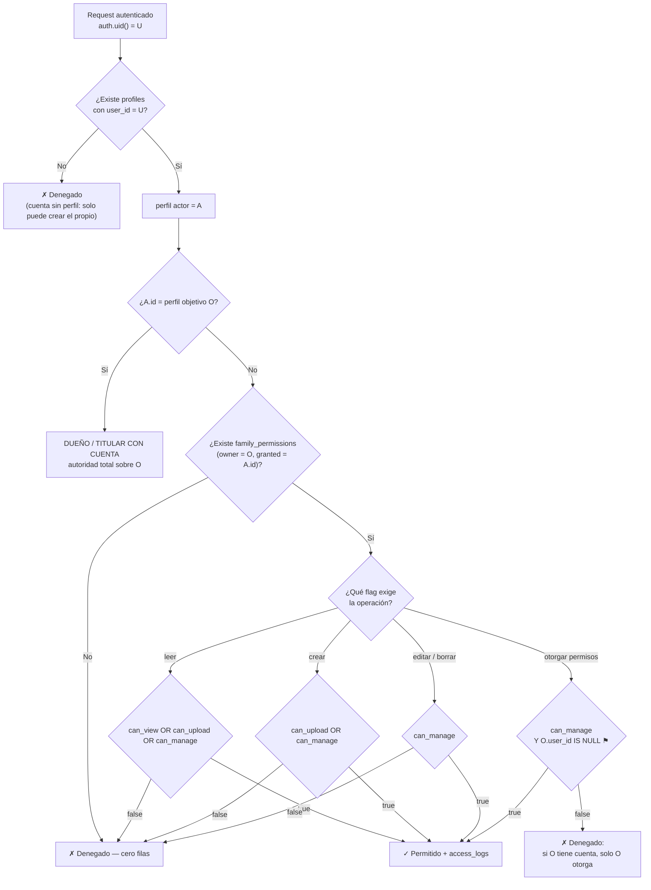

# Modelo de permisos familiares — MiHistorialMédico

> **Qué es este documento:** el contrato del modelo de acceso. Define quién puede hacer qué sobre los datos de salud de quién.
> **Quién lo consume:** la migración `supabase/migrations/20260812220000_rls.sql` (políticas RLS, **ya aplicada** — ver [`seguridad-rls.md`](./seguridad-rls.md)), la migración de Storage (pendiente), `lib/auth/guardas.ts` (`requerirPermiso`) del Sprint 2 y toda Server Action que escriba datos.
> **Relación con el resto:** el esquema y el *por qué* de cada tabla están en [`modelo-datos.md`](./modelo-datos.md); la fuente de verdad estructural es `supabase/migrations/20260812200000_schema_inicial.sql`. Si este documento y el SQL se contradicen, gana el SQL y este archivo se corrige.
> **La matriz de la sección 6 se implementa literalmente**: cada celda es una política o una guarda. Si una política no puede expresar una celda, se documenta la aproximación y su complemento, no se afloja la celda.

**Estado del esquema al escribir este documento:** `profiles` (con `user_id` nullable y su `COMMENT ON COLUMN`) y `family_permissions` (`owner_profile_id`, `granted_profile_id`, `can_view`, `can_upload`, `can_manage`, `UNIQUE` del par, `CHECK` de no autorreferencia) **ya existen y están aplicados**. Este documento no crea ni modifica objetos de base: las necesidades de esquema que detectó el análisis están en la [sección 10, Deuda](#10-deuda-cambios-de-esquema-propuestos-y-no-aplicados).

> **Actualización (Sprint 1, tarea de RLS).** La matriz de la sección 6 **ya está implementada** en `supabase/migrations/20260812220000_rls.sql`, y las deudas **D1, D2, D4, D5 y D8** de la sección 10 se aplicaron en `supabase/migrations/20260812210000_ajustes_modelo.sql`. El mapa celda → política, las funciones auxiliares y las pruebas están en [`seguridad-rls.md`](./seguridad-rls.md). La implementación necesitó **una extensión al contrato** que este documento no previó —la política de arranque de un perfil gestionado, sin la cual el caso B es inimplementable desde la aplicación— explicada en la §2.6 de ese archivo.

---

## 1. Principios

1. **El permiso vive en una sola tabla.** `family_permissions` es el único origen de autoridad delegada. No hay permisos implícitos por apellido, por dispositivo, por rol textual ni por "estar en la misma familia".
2. **`profiles.role` no otorga nada.** El enum `user_role` (`admin`, `elder`, `family_member`, `caregiver`) es **descriptivo**: sirve para redactar la interfaz ("Cuidadora", "Adulto mayor"). **Ninguna política RLS ni guarda puede leer `profiles.role` para decidir un acceso.** Un perfil con `role = 'admin'` y sin fila en `family_permissions` no puede ver absolutamente nada ajeno.
3. **Negación por defecto.** Sin fila de permiso y sin ser el titular, el resultado es cero filas —no un error—: RLS filtra, no rechaza. La app nunca debe distinguir "no existe" de "no tenés permiso" al usuario final.
4. **Minimización.** El acto de invitar otorga **solo `can_view`**. Los defaults de la tabla ya lo encodean (`can_view` default `true`, `can_upload` y `can_manage` default `false`); la interfaz del Sprint 2 no puede pre-marcar los otros dos.
5. **Todo acceso a datos de un tercero deja rastro.** `access_logs` es append-only y consultable por el titular.
6. **El servidor no confía en el cliente.** El perfil activo vive en una cookie `httpOnly`, pero **no es un permiso**: es contexto de interfaz. Cada request revalida contra `family_permissions`.

---

## 2. Vocabulario

Cuatro conceptos que el documento mantiene separados a propósito, porque en el caso del perfil gestionado **no coinciden**:

| Término | Definición | Cómo se identifica |
|---|---|---|
| **Titular de datos** | La persona sobre la que trata el historial. Es quien tiene los derechos de la Ley 25.326 (acceso, rectificación, supresión). | La fila de `profiles`. Siempre. No se transfiere ni se delega. |
| **Perfil actor** | El perfil desde el que se está operando en esta sesión. | `profiles` donde `user_id = auth.uid()`. Es único por cuenta (`profiles_user_id_unico`). |
| **Perfil objetivo** | El perfil cuyos datos se quieren leer o escribir. | El `profile_id` de la fila que se consulta, o el perfil activo del selector. |
| **Administrador** | Quien puede operar sobre el perfil objetivo con máxima autoridad operativa. | El titular con cuenta (`perfil actor = perfil objetivo`), o un perfil con `can_manage = true` sobre el objetivo. |

**Distinción clave:** el titular de datos de un perfil gestionado (Roberto, 78 años, sin cuenta) **nunca es un perfil actor**, porque no puede iniciar sesión. Sus derechos existen igual y se ejercen a través de su administrador, que actúa *por cuenta de* él y no *en lugar de* él. Esa diferencia es la que justifica la trazabilidad: el administrador es un mandatario auditado, no un dueño.

---

## 3. Los tres casos canónicos

Personas usadas en todos los ejemplos:

| Persona | Edad | Cuenta en `auth.users` | Perfil | Rol descriptivo |
|---|---|---|---|---|
| **María Gómez** | 44 | Sí (`maria@ejemplo.ar`) | `p-maria` | `admin` |
| **Roberto Gómez** | 78 | **No** | `p-roberto` | `elder` |
| **Diego Gómez** | 41 | Sí (`diego@ejemplo.ar`) | `p-diego` | `family_member` |
| **Ana Quispe** | 52 | Sí (`ana@ejemplo.ar`) | `p-ana` | `caregiver` |

### 3.1 Caso A — Perfil con cuenta propia

María se registra, y en el mismo alta se crea su perfil con `user_id` apuntando a su cuenta.

```
   auth.users                              public.profiles
 ┌────────────────────────┐              ┌──────────────────────────────────┐
 │ id  = u-maria          │◄─────────────│ id      = p-maria                │
 │ email = maria@ej...    │  user_id     │ user_id = u-maria     ← NO NULL  │
 └────────────────────────┘              │ full_name = "María Gómez"        │
                                         │ role      = 'admin'              │
                                         └──────────────────────────────────┘
                                                        │
                                                        │  es titular Y perfil actor
                                                        ▼
                              documents · lab_metrics · appointments · medications
                              medication_intakes · vital_signs · insurance_cards
                              doctors · family_permissions (como owner)
                                     acceso total, sin fila de permiso
```

- **Cómo se resuelve el acceso:** `profiles.user_id = auth.uid()`. Es la vía directa; **no hay ni debe haber** una fila de `family_permissions` de María sobre sí misma (el `CHECK family_permissions_sin_autoreferencia` lo impide).
- **Qué puede hacer:** todo sobre sus datos, incluido otorgar y revocar permisos a terceros y borrar su perfil.
- **Qué no puede hacer:** ver datos de Roberto, Diego o Ana sin una fila de permiso a su favor.

### 3.2 Caso B — Perfil gestionado sin cuenta (`user_id IS NULL`)

Roberto no usa la app. María crea su perfil, y **en la misma operación** el sistema crea la fila de permiso que lo hace administrable. Sin esa fila el perfil nace inaccesible.

```
   auth.users                              public.profiles
 ┌────────────────────────┐              ┌──────────────────────────────────┐
 │ (ninguna cuenta)       │      ╳       │ id      = p-roberto              │
 └────────────────────────┘              │ user_id = NULL        ← A PROPÓSITO
                                         │ full_name = "Roberto Gómez"      │
                                         │ role      = 'elder'              │
                                         │ blood_type, allergies, ...       │
                                         └──────────────────────────────────┘
                                                        ▲
                                                        │ owner_profile_id
                                         ┌──────────────┴───────────────────┐
                                         │ family_permissions               │
                                         │  owner_profile_id   = p-roberto  │
                                         │  granted_profile_id = p-maria    │
                                         │  can_view   = true               │
                                         │  can_upload = true               │  ← fila de arranque:
                                         │  can_manage = true               │    los tres en true
                                         └──────────────┬───────────────────┘
                                                        │ granted_profile_id
                                                        ▼
                                         ┌──────────────────────────────────┐
                                         │ p-maria  (user_id = u-maria)     │
                                         └──────────────────────────────────┘
```

- **`user_id IS NULL` es la señal de perfil gestionado.** Nunca se completa con un uuid inventado "para evitar el NULL": el `NULL` es lo que las políticas leen para saber que no hay titular capaz de actuar. Está advertido en la base con `COMMENT ON COLUMN public.profiles.user_id`.
- **Fila de arranque (bootstrap).** Quien crea un perfil gestionado recibe, en la misma transacción, una fila con **`can_view`, `can_upload` y `can_manage` en `true`**. Es la única fila de `family_permissions` que la aplicación crea sin que nadie la pida explícitamente, y es obligatoria: un perfil gestionado sin ningún `can_manage` es un [perfil huérfano](#82-perfil-huérfano-un-gestionado-sin-administrador), estado prohibido.
- **Quién es "dueño" acá.** El titular de datos es Roberto; el **administrador raíz** es María, por `can_manage`. En la matriz de la sección 6, un perfil gestionado **no tiene columna "Dueño"**: se lee la columna `can_manage` más las notas marcadas con ⚑, que son las que extienden `can_manage` para cubrir lo que un titular haría por sí mismo (otorgar permisos, borrar el perfil).
- **Si Roberto algún día se anima a tener cuenta:** ver [8.6, transición gestionado → con cuenta](#86-transición-de-gestionado-a-perfil-con-cuenta).

### 3.3 Caso C — Cuidador o familiar con permisos parciales

Dos delegaciones distintas sobre el mismo perfil, que muestran la diferencia entre los flags:

```
                          ┌───────────────────────────────┐
                          │      p-roberto (gestionado)   │
                          │      titular de datos         │
                          └───────────────────────────────┘
                             ▲            ▲            ▲
        can_view ✓           │            │            │        can_view ✓
        can_upload ✓         │            │            │        can_upload ✗
        can_manage ✓         │            │            │        can_manage ✗
                             │            │            │
                  ┌──────────┴──┐  ┌──────┴──────┐  ┌──┴────────────┐
                  │  p-maria    │  │   p-ana     │  │   p-diego     │
                  │  hija       │  │ cuidadora   │  │ hijo, a 2000km│
                  │ ADMINISTRA  │  │ CARGA DATOS │  │ SOLO MIRA     │
                  └─────────────┘  └─────────────┘  └───────────────┘
                                     can_view ✓
                                     can_upload ✓
                                     can_manage ✗
```

**Ana (cuidadora domiciliaria) — `can_view` + `can_upload`:**

- ✓ Ve el historial completo de Roberto: estudios, métricas, turnos, plan de medicación, signos vitales, credencial de la obra social y ficha SOS.
- ✓ Carga la presión de la mañana, sube la foto del análisis que trajeron del laboratorio, registra la toma de la Metformina de las 8:00, agrega el turno con el cardiólogo.
- ✗ **No** suspende una medicación, no edita una dosis, no borra un estudio, no corrige un turno ya cargado.
- ✗ **No** otorga acceso a nadie, ni siquiera a otro cuidador de la misma agencia.
- ✗ **No** recibe las alertas clínicas de Roberto (presión fuera de umbral, receta por vencerse): esas van a los `can_manage`.
- ✗ **No** ve la lista de accesos de Roberto (quién más entró y cuándo). Solo ve sus propias acciones.

**Diego (hijo a distancia) — solo `can_view`:**

- ✓ Entra, mira los últimos estudios, ve el gráfico de glucemia, se queda tranquilo.
- ✗ No escribe nada. Ni una medición, ni una nota.
- Es el permiso **por defecto** al invitar: si Diego después quiere cargar cosas, María le agrega `can_upload` explícitamente.

### 3.4 Árbol de decisión

Este es el orden exacto en que se evalúa "¿puede el actor A operar sobre el perfil O?":



---

## 4. Semántica exacta de los flags

Los tres flags son `boolean NOT NULL`. Se leen siempre **respecto de un par (dueño, autorizado)**: nunca son atributos de una persona, siempre de una relación.

### 4.1 `can_view` — leer

Habilita **`SELECT` sobre todo dato de salud del perfil dueño**, sin excepciones por tabla:

| Qué incluye | Detalle |
|---|---|
| Perfil | Nombre, fecha de nacimiento, DNI, teléfono, avatar y **la ficha SOS completa** (grupo sanguíneo, alergias, condiciones crónicas, medicación crítica, contacto de emergencia, notas) |
| Documentos | Metadatos, resumen de IA, y **emisión de signed URL** para abrir o descargar el archivo del bucket privado |
| Métricas de laboratorio | Valores, unidades, rangos de referencia, series temporales |
| Turnos | Fecha, especialidad, profesional, dirección, coordenadas y preparación previa |
| Medicación | Plan completo, horarios, stock y días restantes |
| Tomas | Historial de tomas: cuáles se registraron, cuáles se saltearon |
| Signos vitales | Tensión, glucemia, peso, con sus gráficos |
| Credenciales de cobertura | Obra social, número de afiliado, plan y **las fotos de frente y dorso** |
| Médicos | La agenda de profesionales del perfil |

**Qué NO incluye `can_view`:**

- **La lista de accesos del perfil dueño** (`access_logs` filtrado por `profile_id`). Es el instrumento con el que el titular controla a sus propios autorizados; dárselo a un autorizado lo vacía de sentido y expone la composición del grupo familiar. El autorizado siempre ve **sus propias acciones** (`actor_user_id = auth.uid()`), que son dato suyo.
- **Las suscripciones push** de las otras personas (ver [6.4](#64-push_subscriptions-no-se-rige-por-family_permissions)).
- **Las demás filas de `family_permissions`** del dueño. Ana ve su propia fila —para saber qué puede hacer— pero no la lista de quién más tiene acceso.

**Cada lectura de un documento, un archivo o una credencial se audita** (`ver_documento`, `descargar_archivo`, `ver_credencial`). El listado de turnos o de métricas **no** genera una fila por render: la granularidad de la auditoría es la que fija el enum `access_action`, y está elegida para que el registro sea legible por una persona mayor, no para que sea exhaustivo hasta el `SELECT`.

### 4.2 `can_upload` — crear contenido nuevo

Habilita **`INSERT`** sobre las tablas de contenido del perfil dueño: `documents`, `lab_metrics`, `appointments`, `medications`, `medication_intakes`, `vital_signs`, `insurance_cards`, `doctors`. Y solo eso.

**`can_upload` NO habilita `UPDATE` ni `DELETE`.** Es la traducción literal de la regla del roadmap: *"el familiar autorizado ve según `can_view` y sube según `can_upload`"*. Consecuencias buscadas:

- Ana sube el análisis, pero si la extracción de IA quedó mal, **no** puede corregir el documento ya persistido: eso es una edición. La corrección la hace María (`can_manage`).
- Por eso el pipeline del Sprint 4 debe **revisar antes de persistir**: la pantalla de revisión edita el JSON extraído y recién entonces se hace el `INSERT`. Si el producto llegara a necesitar "quien subió puede corregir su propia carga durante N horas", hace falta una columna `created_by_profile_id`, que **ya existe** desde `20260812210000_ajustes_modelo.sql` → [Deuda D2](#d2-created_by_profile_id-en-las-tablas-de-contenido). La matriz sigue como está hasta que un caso real de producto pida la corrección propia.
- El **reprocesamiento** de un documento ya guardado (`ON CONFLICT DO UPDATE` sobre `lab_metrics`) es una edición, no una carga: requiere `can_manage`.

**Dos excepciones acotadas y justificadas:**

1. **Registrar una toma de medicación.** Las filas de `medication_intakes` se materializan en estado `pending` y la confirmación las pasa a `taken`. Eso es técnicamente un `UPDATE`, pero funcionalmente es "cargar el dato del día" y es la tarea principal de un cuidador. Se habilita con `can_upload` **restringida a la transición `pending → taken | skipped`** (ver nota ⑩ de la matriz).
2. **El descuento de stock que esa toma provoca** es un `UPDATE` sobre `medications.stock_units`, tabla donde `can_upload` no escribe. No se resuelve ampliando el permiso: se resuelve con una función `SECURITY DEFINER` (`registrar_toma`) que valida `can_upload` y hace las dos escrituras de forma atómica (ver nota ⑨ y [sección 7.3](#73-lo-que-rls-no-puede-expresar-y-con-qué-se-complementa)).

**Relación con `can_view`:** `can_upload` **implica** `can_view`. Nadie carga un estudio a ciegas en un perfil que no puede ver, y una fila con `can_upload = true, can_view = false` produciría el estado absurdo de poder escribir y no poder leer lo escrito. La base **no** lo impide hoy (los tres flags son independientes) → [Deuda D3](#d3-check-de-monotonía-de-los-flags). Mientras tanto, **las políticas RLS de lectura se escriben monótonas**: `can_view OR can_upload OR can_manage`. Así, una fila incoherente nunca produce un estado roto.

### 4.3 `can_manage` — administrar

Es `can_upload` **más**:

| Capacidad | Alcance |
|---|---|
| **`UPDATE` de contenido** | Corregir un documento, editar una dosis, **suspender** una medicación (`is_active = false`), dar de baja un médico, cambiar el estado de un turno, corregir una medición mal cargada |
| **`DELETE` de contenido** | Borrar un estudio subido por error, una credencial vencida, un turno duplicado |
| **`UPDATE` del perfil** | Editar los datos del titular y **la ficha SOS** (grupo sanguíneo, alergias, contacto de emergencia). Es la única forma de que un perfil gestionado tenga la ficha SOS al día |
| **Destinatario de alertas** | Recibe por Web Push las alertas clínicas de signos vitales fuera de umbral (Sprint 9) y las de renovación de receta con menos de 5 días de stock (Sprint 7). **Los `can_view` y `can_upload` no las reciben.** El envío resuelve destinatarios como `family_permissions.can_manage = true` sobre el perfil que dispara la alerta → `granted_profile_id` → `profiles.user_id` → `push_subscriptions` activas |
| **Ver la lista de accesos** | Solo cuando el perfil es **gestionado** ⚑. Si el perfil tiene cuenta, esa vista es exclusiva de su titular |
| **Borrar el perfil** | Solo cuando el perfil es **gestionado** ⚑ (ver [8.5](#85-borrado-de-un-perfil-el-cascade-y-lo-que-el-cascade-no-alcanza)) |

### 4.4 ¿`can_manage` puede otorgar permisos a terceros?

**Regla normativa: NO, salvo en el único caso donde nadie más podría hacerlo.**

> **Regla de la autoridad de otorgamiento.**
> La potestad de crear, editar y revocar filas de `family_permissions` sobre el perfil **O** pertenece:
> - **si `O.user_id IS NOT NULL`** (perfil con cuenta) → **exclusivamente a O**, es decir a la sesión donde `auth.uid() = O.user_id`. **Ni siquiera un `can_manage` sobre O puede otorgar.**
> - **si `O.user_id IS NULL`** (perfil gestionado) → a **cualquier `can_manage` sobre O**, porque el titular no puede iniciar sesión y sin esta excepción el perfil quedaría congelado para siempre en su configuración inicial.

**Por qué se eligió así:**

1. **Minimización (Ley 25.326, art. 4).** El consentimiento para tratar datos sensibles es de la persona, para una finalidad declarada. Si un mandatario puede sub-delegar, el consentimiento original se estira a personas que el titular nunca vio.
2. **La revocación tiene que ser atómica.** Con delegación en cadena, revocar a María no revoca a quien María invitó: quedaría un acceso vivo cuyo origen ya no existe. Con otorgamiento centralizado, `family_permissions` sobre un perfil es una **estrella**, no un grafo: la pantalla "quién ve mis datos" es una lista plana y revocar es borrar una fila.
3. **Escalada de privilegios.** `can_manage` es el permiso más alto delegable; si además pudiera repartirlo, un solo autorizado alcanzaría para abrir el historial a un número ilimitado de personas.
4. **Auditoría legible.** Con un solo otorgante, la respuesta a "¿por qué esta persona tiene acceso?" es siempre una fila de `access_logs` con acción `otorgar_permiso` firmada por el titular.

**Guardas de la excepción** (perfil gestionado, varios administradores posibles):

- **Sin escalada:** un administrador nunca puede otorgar flags que él mismo no tenga. Como solo los `can_manage` pueden otorgar y `can_manage` es el tope, esto se reduce a: puede otorgar cualquier combinación, pero cada otorgamiento queda auditado con su firma.
- **Sin destituciones cruzadas:** un administrador **no puede borrar ni bajarle los flags a otra fila con `can_manage = true`**. Puede revocar `can_view` y `can_upload` de terceros, y puede borrar **su propia** fila (renunciar). Esto evita la guerra de hermanos donde el que llega primero al botón deja al otro afuera del historial del padre.
- **Sin dejar el perfil huérfano:** la renuncia del último `can_manage` se rechaza (ver [8.2](#82-perfil-huérfano-un-gestionado-sin-administrador)).
- **Todo otorgamiento y toda revocación escriben en `access_logs`** (`otorgar_permiso`, `revocar_permiso`), con el par afectado en `metadata`.

### 4.5 Resumen de los tres flags

```
                        leer      crear     editar/    otorgar    recibe
                                            borrar     permisos   alertas
  can_view               ✓          ✗          ✗           ✗          ✗
  can_upload             ✓          ✓          ✗ (*)       ✗          ✗
  can_manage             ✓          ✓          ✓           ⚑          ✓
  titular con cuenta     ✓          ✓          ✓           ✓          ✓

  (*) salvo la transición pending → taken|skipped de medication_intakes
  ⚑   solo si el perfil dueño es gestionado (user_id IS NULL)
```

---

## 5. Quién es "dueño": la regla

**Titular de datos y administrador son cosas distintas.** El primero es un hecho sobre la persona; el segundo es una capacidad operativa.

```
  ┌───────────────────────────────────────────────────────────────────────────┐
  │  perfil O                                                                 │
  ├───────────────────────────┬───────────────────────────────────────────────┤
  │  O.user_id IS NOT NULL    │  O.user_id IS NULL                            │
  │  (perfil con cuenta)      │  (perfil gestionado)                          │
  ├───────────────────────────┼───────────────────────────────────────────────┤
  │ Titular de datos:   O     │ Titular de datos:   O  (no puede iniciar      │
  │ Administrador:      O     │                        sesión)                │
  │ Puede otorgar:      O     │ Administrador:      todo can_manage sobre O   │
  │ Ve access_logs:     O     │ Puede otorgar:      todo can_manage sobre O ⚑ │
  │ Puede borrar O:     O     │ Ve access_logs:     todo can_manage sobre O ⚑ │
  │                           │ Puede borrar O:     todo can_manage sobre O ⚑ │
  └───────────────────────────┴───────────────────────────────────────────────┘
```

**Predicado normativo, en una línea:**

> El actor `A` es **dueño** del perfil `O` si `O.user_id = auth.uid()`.
> El actor `A` es **administrador** de `O` si es dueño de `O`, **o** existe `family_permissions(owner_profile_id = O, granted_profile_id = A, can_manage = true)`.
> El actor `A` es **autoridad de otorgamiento** sobre `O` si es dueño de `O`, **o** (`O.user_id IS NULL` y es administrador de `O`).

**El creador de un perfil gestionado recibe la fila de arranque con los tres flags en `true`.** Es lo que convierte "creé un perfil" en "puedo administrarlo", y es lo que garantiza que ningún perfil gestionado nazca huérfano. Hoy esa fila es la **única** huella de quién creó el perfil: `profiles` no guarda al creador → [Deuda D1](#d1-created_by_profile_id-en-profiles).

---

## 6. Matriz rol × recurso × operación

**Este es el contrato.** Cada celda se implementa literalmente en `supabase/migrations/20260812220000_rls.sql`. El mapa celda por celda hasta el nombre de cada política está en [`seguridad-rls.md`](./seguridad-rls.md).

**Cómo leerla.** Las columnas son la posición del **actor** respecto del **perfil objetivo O**:

- **Dueño** — `O.user_id = auth.uid()`. Columna aplicable **solo si O tiene cuenta**.
- **can_view / can_upload / can_manage** — hay fila de `family_permissions(owner = O, granted = perfil actor)` con ese flag. Se leen **acumulativas**: `can_upload` incluye lo de `can_view`, `can_manage` incluye lo de `can_upload`.
- **Sin permiso** — ni dueño ni fila de permiso. Resultado esperado: **cero filas**, nunca un error que revele la existencia del dato.
- **Si O es gestionado (`user_id IS NULL`)** no hay columna "Dueño": se lee `can_manage` y se aplican las notas **⚑**, que son las que le transfieren las potestades del titular ausente.

Símbolos: **✓** permitido · **✗** denegado · **⚑** extensión que aplica solo a perfiles gestionados · **①..⑰** notas al pie.

| Recurso | Op. | Dueño | can_view | can_upload | can_manage | Sin permiso |
|---|---|:--:|:--:|:--:|:--:|:--:|
| `profiles` (fila de O) | SELECT | ✓ | ✓ | ✓ | ✓ | ✗ |
| `profiles` | INSERT | ① | ① | ① | ① | ① |
| `profiles` | UPDATE | ✓ | ✗ | ✗ | ✓ ② | ✗ |
| `profiles` | DELETE | ✓ | ✗ | ✗ | ⚑ ③ | ✗ |
| `family_permissions` (owner = O) | SELECT | ✓ | ✓ ④ | ✓ ④ | ✓ | ✗ |
| `family_permissions` | INSERT | ✓ | ✗ | ✗ | ⚑ ⑤ | ✗ |
| `family_permissions` | UPDATE | ✓ | ✗ | ✗ | ⚑ ⑤⑥ | ✗ |
| `family_permissions` | DELETE | ✓ | ✓ ⑦ | ✓ ⑦ | ⚑ ⑥⑦ | ✗ |
| `documents` | SELECT | ✓ | ✓ ⑧ | ✓ ⑧ | ✓ ⑧ | ✗ |
| `documents` | INSERT | ✓ | ✗ | ✓ | ✓ | ✗ |
| `documents` | UPDATE | ✓ | ✗ | ✗ | ✓ | ✗ |
| `documents` | DELETE | ✓ | ✗ | ✗ | ✓ | ✗ |
| `lab_metrics` | SELECT | ✓ | ✓ | ✓ | ✓ | ✗ |
| `lab_metrics` | INSERT | ✓ | ✗ | ✓ | ✓ | ✗ |
| `lab_metrics` | UPDATE | ✓ | ✗ | ✗ | ✓ ⑫ | ✗ |
| `lab_metrics` | DELETE | ✓ | ✗ | ✗ | ✓ | ✗ |
| `appointments` | SELECT | ✓ | ✓ | ✓ | ✓ | ✗ |
| `appointments` | INSERT | ✓ | ✗ | ✓ | ✓ | ✗ |
| `appointments` | UPDATE | ✓ | ✗ | ✗ ⑬ | ✓ | ✗ |
| `appointments` | DELETE | ✓ | ✗ | ✗ | ✓ | ✗ |
| `medications` | SELECT | ✓ | ✓ | ✓ | ✓ | ✗ |
| `medications` | INSERT | ✓ | ✗ | ✓ | ✓ | ✗ |
| `medications` | UPDATE | ✓ | ✗ | ✗ ⑨ | ✓ | ✗ |
| `medications` | DELETE | ✓ | ✗ | ✗ | ✓ ⑭ | ✗ |
| `medication_intakes` | SELECT | ✓ | ✓ | ✓ | ✓ | ✗ |
| `medication_intakes` | INSERT | ✓ | ✗ | ✓ | ✓ | ✗ |
| `medication_intakes` | UPDATE | ✓ | ✗ | ✓ ⑩ | ✓ | ✗ |
| `medication_intakes` | DELETE | ✓ | ✗ | ✗ | ✓ | ✗ |
| `vital_signs` | SELECT | ✓ | ✓ | ✓ | ✓ | ✗ |
| `vital_signs` | INSERT | ✓ | ✗ | ✓ | ✓ | ✗ |
| `vital_signs` | UPDATE | ✓ | ✗ | ✗ | ✓ | ✗ |
| `vital_signs` | DELETE | ✓ | ✗ | ✗ | ✓ | ✗ |
| `insurance_cards` | SELECT | ✓ | ✓ ⑮ | ✓ ⑮ | ✓ ⑮ | ✗ |
| `insurance_cards` | INSERT | ✓ | ✗ | ✓ | ✓ | ✗ |
| `insurance_cards` | UPDATE | ✓ | ✗ | ✗ | ✓ | ✗ |
| `insurance_cards` | DELETE | ✓ | ✗ | ✗ | ✓ | ✗ |
| `doctors` | SELECT | ✓ | ✓ | ✓ | ✓ | ✗ |
| `doctors` | INSERT | ✓ | ✗ | ✓ | ✓ | ✗ |
| `doctors` | UPDATE | ✓ | ✗ | ✗ | ✓ ⑭ | ✗ |
| `doctors` | DELETE | ✓ | ✗ | ✗ | ✓ | ✗ |
| `access_logs` (profile_id = O) | SELECT | ✓ | ✗ ⑪ | ✗ ⑪ | ⚑ ⑪ | ✗ ⑪ |
| `access_logs` | INSERT | ✓ ⑯ | ✓ ⑯ | ✓ ⑯ | ✓ ⑯ | ✓ ⑯ |
| `access_logs` | UPDATE | ✗ | ✗ | ✗ | ✗ | ✗ |
| `access_logs` | DELETE | ✗ | ✗ | ✗ | ✗ | ✗ |
| `push_subscriptions` | SELECT | ⑰ | ⑰ | ⑰ | ⑰ | ⑰ |
| `push_subscriptions` | INSERT | ⑰ | ⑰ | ⑰ | ⑰ | ⑰ |
| `push_subscriptions` | UPDATE | ⑰ | ⑰ | ⑰ | ⑰ | ⑰ |
| `push_subscriptions` | DELETE | ⑰ | ⑰ | ⑰ | ⑰ | ⑰ |

### Notas

**①  `INSERT` en `profiles` no se evalúa contra un perfil objetivo preexistente.** Regla propia: cualquier usuario autenticado puede insertar **(a)** su propio perfil, con `user_id = auth.uid()` —una sola vez, lo garantiza `profiles_user_id_unico`—, o **(b)** un perfil gestionado, con `user_id IS NULL`. **Está prohibido insertar una fila con `user_id` de otra cuenta**; la política lo expresa como `user_id IS NULL OR user_id = auth.uid()`. El caso (b) obliga a crear la fila de arranque de `family_permissions` en la misma transacción.

**②  `UPDATE` de `profiles` con `can_manage`:** alcanza los datos de contacto, el avatar y toda la ficha SOS. **No** alcanza `user_id`: cambiar a qué cuenta pertenece un perfil no es una edición, es un cambio de titularidad, y no está habilitado a nadie desde la aplicación (ver [8.6](#86-transición-de-gestionado-a-perfil-con-cuenta)).

**③ ⚑  `DELETE` de `profiles` con `can_manage` solo si `O.user_id IS NULL`.** Un perfil con cuenta lo borra únicamente su titular. Un perfil gestionado tiene que poder borrarse (el titular falleció, la familia ejerce la supresión) y el único que puede hacerlo es su administrador. Exige doble confirmación en la interfaz, se audita, y arrastra el `CASCADE` descripto en [8.5](#85-borrado-de-un-perfil-el-cascade-y-lo-que-el-cascade-no-alcanza).

**④  Un autorizado ve solo su propia fila** de `family_permissions` (`granted_profile_id = perfil actor`), para que la interfaz pueda mostrarle qué puede hacer. **No** ve las filas de los demás autorizados: la composición del grupo de acceso es información del titular.

**⑤ ⚑  Otorgar solo si `O.user_id IS NULL`.** Si O tiene cuenta, la autoridad de otorgamiento es exclusiva de O ([4.4](#44-can_manage-puede-otorgar-permisos-a-terceros)).

**⑥  Un administrador no puede tocar la fila de otro administrador.** Ni bajarle los flags (`UPDATE`) ni borrarla (`DELETE`) si esa fila tiene `can_manage = true` y no es la suya. Sí puede editar o revocar filas de `can_view` / `can_upload`.

**⑦  Renuncia.** Todo autorizado puede borrar **su propia** fila (`granted_profile_id = perfil actor`) para dejar de tener acceso. Se rechaza si es el último `can_manage` de un perfil gestionado ([8.2](#82-perfil-huérfano-un-gestionado-sin-administrador)).

**⑧  Leer el archivo es otra capa.** La fila de `documents` la filtra RLS; el **contenido** vive en el bucket privado `documentos-medicos` y se sirve exclusivamente por signed URL de vida corta generada en el servidor. La política de Storage tiene que replicar esta misma celda ([7.4](#74-puente-con-las-políticas-de-storage)).

**⑨  El descuento de stock no amplía `can_upload`.** Registrar una toma modifica `medications.stock_units`, y `can_upload` no escribe en `medications`. Se resuelve con una función `SECURITY DEFINER` (`registrar_toma`) que valida `can_upload` sobre el perfil y hace el `UPDATE` del intake y el descuento de stock de forma atómica. Insumo para el Sprint 7.

**⑩  Excepción de la toma.** `can_upload` puede hacer `UPDATE` sobre `medication_intakes` **solo** en la transición `pending → taken | skipped`. En RLS: `USING (... AND status = 'pending')` sobre la fila vieja y `WITH CHECK (status IN ('taken','skipped'))` sobre la nueva. RLS no compara columna a columna contra `OLD`, así que la garantía de que no se toque `scheduled_at` en la misma sentencia se completa con un trigger `BEFORE UPDATE` ([7.3](#73-lo-que-rls-no-puede-expresar-y-con-qué-se-complementa)).

**⑪  `access_logs` por `profile_id`:** la lista de accesos de O la ve el titular de O si tiene cuenta, o —⚑— sus `can_manage` si O es gestionado. **Independientemente de eso, cualquier actor ve siempre sus propias filas** (`actor_user_id = auth.uid()`): son sus datos, y es lo que le permite verificar qué quedó registrado a su nombre.

**⑫  Reprocesar un documento es editar.** El `ON CONFLICT DO UPDATE` sobre `lab_metrics` que dispara una nueva extracción requiere `can_manage`. La primera extracción, que solo inserta, se cubre con `can_upload`.

**⑬  Punto abierto del Sprint 6.** Confirmar o cancelar un turno es hoy `can_manage`. Si el producto quiere que un cuidador con `can_upload` marque un turno como `completed`, se agrega una excepción análoga a la ⑩ (restringida a la columna `status`). **No requiere cambio de esquema**, solo una política más laxa; se decide al implementar el CRUD de turnos.

**⑭  En la práctica no se borra, se da de baja.** `medications` y `doctors` usan baja lógica (`is_active = false` + su marca de tiempo). El `DELETE` queda habilitado para `can_manage` por completitud, pero la interfaz ofrece "suspender" / "dar de baja", no "eliminar".

**⑮  Ver una credencial se audita siempre** con `ver_credencial`, y abrir la foto pasa por signed URL contra el bucket `credenciales-cobertura`.

**⑯  `INSERT` en `access_logs` está habilitado para todo usuario autenticado, con `WITH CHECK (actor_user_id = auth.uid())`:** nadie puede escribir una entrada de auditoría a nombre de otro. En la práctica escribe siempre el servidor, pero la política impide falsificar el actor aunque alguien use el cliente directo.

**⑰  `push_subscriptions` está fuera del modelo familiar:** ver [6.4](#64-push_subscriptions-no-se-rige-por-family_permissions).

### 6.1 Regla general que resume casi toda la tabla

Para las ocho tablas de contenido (`documents`, `lab_metrics`, `appointments`, `medications`, `medication_intakes`, `vital_signs`, `insurance_cards`, `doctors`) la matriz colapsa en tres predicados:

| Operación | Predicado |
|---|---|
| `SELECT` | dueño **O** (`can_view` **O** `can_upload` **O** `can_manage`) |
| `INSERT` | dueño **O** (`can_upload` **O** `can_manage`) |
| `UPDATE` / `DELETE` | dueño **O** `can_manage` |

Con **dos excepciones**, ambas en el circuito de medicación: nota ⑩ (`medication_intakes` UPDATE) y nota ⑨ (descuento de stock por RPC).

### 6.2 Lo que ningún permiso otorga jamás

- Leer, editar o borrar la fila de `access_logs` de otra persona.
- Escribir una fila de auditoría a nombre de otro actor.
- Modificar o borrar cualquier fila de `access_logs` (append-only, sin excepción, para todos los roles).
- Cambiar `profiles.user_id`.
- Acceder a las `push_subscriptions` de otra cuenta.
- Ver los datos de un perfil sobre el que no hay ni titularidad ni fila de permiso, **aunque se fuerce la cookie de perfil activo**: el perfil activo es contexto de interfaz, no autorización.

### 6.3 `access_logs`: qué se registra

| Acción del enum | Cuándo se escribe |
|---|---|
| `login` / `logout` | Inicio y cierre de sesión |
| `ver_perfil` | Al fijar un perfil activo distinto del propio en el selector |
| `ver_documento` | Al abrir la ficha de un documento |
| `descargar_archivo` | Al emitir una signed URL de descarga |
| `ver_credencial` | Al abrir una credencial de cobertura |
| `exportar_ficha` | Al generar la exportación de la ficha del perfil |
| `otorgar_permiso` | Al crear o ampliar una fila de `family_permissions` |
| `revocar_permiso` | Al borrar o reducir una fila de `family_permissions` |

Los listados (galería de estudios, agenda de turnos, series de métricas) **no** generan una fila cada uno: quedan cubiertos por el `ver_perfil` de la sesión. Es una decisión de legibilidad —la vista de accesos del titular tiene que leerse como *"María vio los estudios de Roberto — 12/08 14:30"*, no como un log de servidor— y de volumen.

### 6.4 `push_subscriptions` no se rige por `family_permissions`

Una suscripción Web Push pertenece a **un navegador de una persona**, no a un perfil. Aunque la tabla tenga `profile_id` (contexto de qué perfil estaba activo al suscribirse), **las políticas se resuelven exclusivamente por `user_id = auth.uid()`** para las cuatro operaciones.

**Por qué importa:** si las políticas se escribieran "por perfil" como el resto de las tablas, el dueño de un perfil podría listar las suscripciones de quien lo administra y con ellas el `user_agent` y los endpoints de sus dispositivos. Es información del cuidador, no del titular, y no hay ninguna función de producto que la necesite.

El **envío** de notificaciones sí cruza las dos cosas, pero ocurre del lado del servidor: la Edge Function con `service_role` resuelve destinatarios como `perfil que dispara la alerta → family_permissions con can_manage → granted_profile_id → profiles.user_id → push_subscriptions activas`. Eso pasa por encima de RLS **por diseño** y nunca se ejecuta con el JWT de un usuario.

---

## 7. Cómo se traduce a RLS (insumo para `20260812220000_rls.sql`)

Esta sección **no es la migración** y no incorpora SQL al proyecto: describe la forma que deben tener las políticas para que la matriz de la sección 6 quede implementada sin agujeros ni recursión.

### 7.1 El problema de recursión, concreto

La política de `SELECT` sobre `profiles` necesita consultar `family_permissions`. La política de `family_permissions` necesita resolver cuál es el perfil del actor, o sea consultar `profiles`. Postgres detecta el ciclo y aborta con **`42P17 infinite recursion detected in policy for relation "profiles"`**.

La salida es la que ya anticipa `modelo-datos.md`: funciones **`SECURITY DEFINER`** que consultan las tablas **sin** pasar por RLS, y que las políticas invocan como predicado.

### 7.2 Funciones auxiliares que la migración debe crear

Todas `SECURITY DEFINER`, `STABLE`, con `SET search_path = ''` (lint `function_search_path_mutable` de Supabase), y con `EXECUTE` revocado de `public` y otorgado a `authenticated`:

| Función | Devuelve | Semántica |
|---|---|---|
| `public.perfil_actor()` | `uuid` | El `profiles.id` cuyo `user_id = auth.uid()`. `NULL` si la cuenta todavía no tiene perfil |
| `public.es_titular(perfil uuid)` | `boolean` | `perfil` existe y su `user_id = auth.uid()` |
| `public.puede_ver_perfil(perfil uuid)` | `boolean` | titular **o** existe permiso con `can_view OR can_upload OR can_manage` |
| `public.puede_cargar_en_perfil(perfil uuid)` | `boolean` | titular **o** existe permiso con `can_upload OR can_manage` |
| `public.puede_administrar_perfil(perfil uuid)` | `boolean` | titular **o** existe permiso con `can_manage` |
| `public.puede_otorgar_permisos(perfil uuid)` | `boolean` | titular **o** (`perfil.user_id IS NULL` **y** `can_manage`) — implementa [4.4](#44-can_manage-puede-otorgar-permisos-a-terceros) |
| `public.es_perfil_gestionado(perfil uuid)` | `boolean` | `perfil.user_id IS NULL` |

Notas de implementación que conviene no descubrir en caliente:

- Los predicados son **monótonos**: `puede_ver_perfil` acepta también a quien tenga solo `can_upload` o solo `can_manage`, para que una fila incoherente (mientras no exista la [Deuda D3](#d3-check-de-monotonía-de-los-flags)) no produzca un estado sin lectura.
- `STABLE` (no `VOLATILE`) permite que el planner las evalúe una vez por sentencia en lugar de una vez por fila.
- Cada política debe usar **una sola** de estas funciones por cláusula; combinar dos `EXISTS` inline en la política es lo que reintroduce la recursión.
- Las políticas de `INSERT` van en `WITH CHECK`; las de `UPDATE` necesitan **`USING` (fila vieja) y `WITH CHECK` (fila nueva)**, y omitir el segundo permite mover una fila a un `profile_id` ajeno.

### 7.3 Lo que RLS no puede expresar, y con qué se complementa

| Celda de la matriz | Limitación de RLS | Complemento |
|---|---|---|
| ⑩ transición `pending → taken` sin tocar `scheduled_at` | RLS restringe la fila resultante, no qué columnas cambiaron | Trigger `BEFORE UPDATE` en `medication_intakes` que rechace cambios de `medication_id` / `scheduled_at` cuando el actor no es administrador |
| ⑨ descuento de stock al registrar la toma | Requiere escribir en dos tablas con permisos distintos, atómicamente | Función `SECURITY DEFINER` `registrar_toma(...)` que valida `puede_cargar_en_perfil` y hace ambas escrituras |
| ⑥ un administrador no destituye a otro | Comparar la fila vieja contra el flag de la fila propia es expresable, pero queda ilegible dentro de la política | Función auxiliar en el predicado `USING` de `family_permissions`, más validación en la Server Action del ABM |
| [8.2](#82-perfil-huérfano-un-gestionado-sin-administrador) no dejar un gestionado sin administrador | RLS autoriza filas, no verifica el estado global posterior | Trigger `BEFORE DELETE OR UPDATE` en `family_permissions` → [Deuda D4](#d4-invariante-de-no-orfandad) |
| ② no cambiar `user_id` en un `UPDATE` de `profiles` | `WITH CHECK` puede exigir `user_id = auth.uid() OR user_id IS NULL`, pero no "igual al valor anterior" | Trigger que rechace `NEW.user_id IS DISTINCT FROM OLD.user_id` desde una sesión de usuario |

### 7.4 Puente con las políticas de Storage

Los buckets `documentos-medicos` y `credenciales-cobertura` son privados y su política tiene que **replicar la misma matriz**, no una versión relajada. El puente es la convención de path: **el primer segmento del path es el `profile_id`** (`{profile_id}/{anio}/{uuid}.{ext}` para documentos, `{profile_id}/{card_id}/{side}.jpg` para credenciales), de modo que la política de `storage.objects` deriva el perfil del nombre del objeto y llama a las mismas funciones auxiliares:

- **leer / emitir signed URL** → `puede_ver_perfil(primer_segmento_del_path)`
- **subir** → `puede_cargar_en_perfil(...)`
- **reemplazar / borrar** → `puede_administrar_perfil(...)`

Si Storage quedara más laxo que la base, el modelo entero es decorativo: el archivo *es* el dato de salud.

---

## 8. Casos borde

### 8.1 Revocación

**Qué se espera:** borrar la fila de `family_permissions` corta el acceso.

**Qué es realmente inmediato y qué no:**

```
  t0   María borra la fila (owner=p-roberto, granted=p-ana)
       └─► access_logs: revocar_permiso                        [inmediato]
  t0   Cualquier consulta nueva de Ana sobre datos de Roberto
       devuelve 0 filas por RLS                                [inmediato]
  t0   Roberto desaparece del selector de perfiles de Ana      [al próximo render]
  t0+  Páginas ya renderizadas en el navegador de Ana siguen
       mostrando datos hasta que navegue o refresque           [hasta la próxima request]
  t0+  Signed URLs ya emitidas a Ana siguen sirviendo el
       archivo hasta que expiren                               [hasta el TTL]
  t0+  Datos cacheados por el service worker para la ficha
       SOS offline siguen en el dispositivo de Ana             [hasta la purga]
```

**Reglas que se derivan:**

1. **TTL corto de signed URLs** (60 a 300 segundos). Es el único límite real de la ventana post-revocación sobre archivos, y por eso el proyecto prohíbe guardar URLs públicas en la base (los `CHECK ... not like 'http%'` del esquema).
2. **El perfil activo se revalida en cada request del servidor.** Si la cookie apunta a un perfil sobre el que ya no hay permiso, se redirige al selector; nunca se sirve una página con datos y un error visual.
3. **El service worker purga el cache de perfiles al perder el permiso o cerrar sesión** (requisito para el Sprint 8, donde se define el cache offline de la ficha SOS).
4. **Revocar no borra el historial de auditoría.** Lo que Ana vio mientras tuvo permiso sigue registrado; ese es justamente el punto.
5. **Reducir flags es también revocar.** Bajar `can_upload` a `false` escribe `revocar_permiso` con el detalle en `metadata`, igual que borrar la fila.

### 8.2 Perfil huérfano: un gestionado sin administrador

**Definición:** un perfil con `user_id IS NULL` y **cero** filas de `family_permissions` con `can_manage = true`.

**Regla: está prohibido. Es un estado inválido del sistema, no una configuración posible.**

Un perfil huérfano guarda datos de salud de una persona real que **nadie puede leer, corregir ni borrar**: falla simultáneamente el derecho de acceso, el de rectificación y el de supresión de la Ley 25.326, y los datos quedan almacenados indefinidamente sin finalidad. Es peor que borrarlos.

**Los tres caminos que llevan a la orfandad y cómo se cierra cada uno:**

| Camino | Cierre |
|---|---|
| El último administrador **revoca su propia** fila (renuncia) | La Server Action del ABM rechaza la operación y ofrece dos salidas explícitas: **transferir la administración** (otorgar `can_manage` a otra persona y recién entonces renunciar) o **eliminar el perfil y sus datos** |
| Otro administrador borra la fila del último `can_manage` | Imposible por la nota ⑥: nadie puede borrar la fila `can_manage` de otro |
| **El administrador borra su cuenta**: `auth.users` → `CASCADE` → su `profiles` → `CASCADE` → sus filas de `family_permissions` | **No lo intercepta la aplicación**: el `CASCADE` ocurre en la base. El flujo de baja de cuenta debe, antes de borrar, detectar los perfiles gestionados donde el usuario es el único administrador y **obligar a transferir o eliminar**. La garantía dura vive en el trigger de la [Deuda D4](#d4-invariante-de-no-orfandad) |

**Perfiles con cuenta no pueden quedar huérfanos** por definición: su titular siempre puede entrar. Que se queden sin ningún autorizado es normal y deseable —es el estado de mínima exposición—.

### 8.3 Autopermiso

Otorgarse permiso sobre uno mismo lo impide el `CHECK family_permissions_sin_autoreferencia` (`owner_profile_id <> granted_profile_id`), y está bien que así sea:

- Sería **redundante**: el acceso propio se resuelve por `user_id = auth.uid()`, antes de mirar `family_permissions`.
- Sería **engañoso**: una fila propia con `can_view = false` sugeriría que el titular no puede leer sus datos, cuando RLS igual lo dejaría entrar por la vía del titular. Una regla que la base muestra pero no aplica es peor que no tenerla.
- **Cierra el grafo**: sin autorreferencia y sin sub-delegación ([4.4](#44-can_manage-puede-otorgar-permisos-a-terceros)), `family_permissions` no tiene ciclos y "quién accede a mis datos" se responde con un `SELECT` plano, sin recorrido transitivo.

### 8.4 Menores y personas con capacidad restringida

El modelo **no** implementa reglas automáticas por edad. `profiles.date_of_birth` es informativo y ninguna política lo lee.

- Un hijo chico se modela como **perfil gestionado** (`user_id IS NULL`), administrado por madre o padre: es exactamente el caso B, con otro vínculo jurídico detrás (responsabilidad parental en lugar de mandato).
- Un adolescente puede tener **perfil con cuenta**, y entonces es titular pleno: puede revocarle el acceso a su madre y ella no puede reponérselo sin que él lo otorgue.
- **No hay transición automática al cumplir años.** El Código Civil y Comercial argentino reconoce autonomía progresiva en decisiones de salud (art. 26), pero traducir eso a una regla de software —a qué edad, para qué tipo de dato, con qué excepciones— es una decisión de producto y legal que este sprint no tiene mandato para tomar. Queda registrada como decisión **deliberadamente no tomada**, igual que el catálogo global de médicos en `modelo-datos.md`.
- Lo que sí exige el modelo hoy: quien crea un perfil gestionado **declara** que tiene el consentimiento del titular o su representación legal. Hoy esa declaración no se persiste en ningún lado → [Deuda D6](#d6-registro-del-consentimiento-en-perfiles-gestionados).

### 8.5 Borrado de un perfil: el `CASCADE` y lo que el `CASCADE` no alcanza

Borrar una fila de `profiles` dispara, por las `FOREIGN KEY` ya definidas:

```
  DELETE profiles (p-roberto)
   │
   ├─► CASCADE  family_permissions  (todas las filas donde es owner Y donde es granted)
   ├─► CASCADE  doctors
   ├─► CASCADE  documents ──► CASCADE lab_metrics (las que tienen document_id)
   ├─► CASCADE  lab_metrics
   ├─► CASCADE  appointments
   ├─► CASCADE  medications ──► CASCADE medication_intakes
   ├─► CASCADE  medication_intakes
   ├─► CASCADE  vital_signs
   ├─► CASCADE  insurance_cards
   ├─► CASCADE  push_subscriptions  (las que tenían este perfil como contexto)
   │
   └─► SET NULL access_logs.profile_id / actor_profile_id
                  ← la auditoría SOBREVIVE, anonimizada
```

**Consecuencias a tener presentes:**

1. **Es el mecanismo del derecho de supresión** (Ley 25.326, art. 16). Es total y no es reversible: no hay baja lógica de perfiles, a diferencia de médicos y medicación.
2. **La auditoría sobrevive** porque `access_logs` usa `SET NULL`. Queda el registro de que hubo accesos, sin la persona. Es lo correcto: la traza de acceso es también dato de las personas que accedieron.
3. **Los archivos de Storage NO se borran.** Ningún `CASCADE` de Postgres alcanza a `storage.objects`. Borrar el perfil deja los PDF y las fotos de credenciales huérfanos en los buckets: los datos de salud siguen existiendo. **El flujo de supresión debe borrar los objetos explícitamente del lado del servidor antes de borrar la fila.** Es la deuda más importante de esta lista → [Deuda D5](#d5-limpieza-de-storage-al-borrar-un-perfil).
4. **Borrar la cuenta borra el perfil propio y todo su historial**, por `profiles.user_id ON DELETE CASCADE`. El flujo de baja tiene que ofrecer la **exportación previa** (derecho de acceso) y advertirlo en lenguaje claro.
5. **Borrar la cuenta de un administrador puede orfanar perfiles gestionados** ([8.2](#82-perfil-huérfano-un-gestionado-sin-administrador), tercer camino).
6. **Los permisos que la persona había otorgado también se borran**, en ambos sentidos del par. Nadie queda con acceso a datos de un perfil inexistente.
7. **Se borran suscripciones push que no son del perfil borrado.** `push_subscriptions.profile_id` es `ON DELETE CASCADE`, así que borrar el perfil de Roberto elimina la suscripción de María si ella se suscribió mientras tenía a Roberto como perfil activo — y María deja de recibir **todas** sus notificaciones, incluidas las de su propio historial, hasta que vuelva a suscribirse. Es un efecto colateral no buscado → [Deuda D8](#d8-push_subscriptionsprofile_id-debería-ser-set-null).

### 8.6 Transición de gestionado a perfil con cuenta

Roberto se compra un celular y quiere entrar él mismo. La operación es `UPDATE profiles SET user_id = <uuid nuevo> WHERE id = p-roberto`, y es **la única operación del modelo que ningún rol puede hacer desde la aplicación** (nota ②): cambia la titularidad, y una escritura de titularidad disponible en la app es una puerta para adueñarse del historial de otro.

Cuando se implemente (no está en Sprint 1 ni 2), debe ser un flujo dedicado, server-side, que:

1. Verifique que `profiles.user_id IS NULL` (no se "roba" un perfil que ya tiene dueño).
2. Vincule una cuenta recién creada y verificada por email, nunca una preexistente con perfil propio (lo impediría igual `profiles_user_id_unico`).
3. **Conserve** las filas de `family_permissions` existentes: la familia sigue viendo lo mismo que antes hasta que Roberto decida lo contrario.
4. **Transfiera la autoridad de otorgamiento** a Roberto de forma automática: al dejar de ser `user_id IS NULL`, las notas ⚑ dejan de aplicar y los `can_manage` pierden la potestad de otorgar, ver la lista de accesos y borrar el perfil. **Eso ocurre solo, sin migrar datos**, porque las políticas leen `user_id IS NULL` en tiempo de consulta. Es la principal ventaja de haber puesto la regla ahí y no en una columna aparte.
5. Se audite con una acción propia (hoy el enum `access_action` no tiene un literal para esto → se resuelve con `otorgar_permiso` + `metadata`, o se agrega el valor al enum cuando se implemente).

### 8.7 Permiso otorgado a un perfil que no tiene cuenta

`family_permissions.granted_profile_id` puede apuntar a un perfil gestionado, y la base no lo impide. La fila resultante es **inerte**: RLS resuelve al autorizado por `auth.uid() → profiles`, y un perfil sin `user_id` nunca coincide con ninguna sesión.

Es peor que inútil: en la pantalla de la familia se ve como un acceso concedido que en realidad no existe, y da una falsa sensación de que "Roberto también puede ver lo de María". **La Server Action del ABM debe rechazarlo** con un mensaje claro ("Esa persona todavía no tiene cuenta propia"), y la garantía dura queda en la [Deuda D7](#d7-el-autorizado-debe-tener-cuenta).

---

## 9. Cumplimiento (Ley 25.326)

Los datos de salud son **datos sensibles** (art. 2 y 7): su tratamiento requiere consentimiento libre, expreso e informado, y debe limitarse a la finalidad declarada.

### 9.1 Minimización

- **Invitar otorga solo `can_view`.** Los defaults de la tabla ya lo encodean (`can_view` `true`, `can_upload` y `can_manage` `false`), la interfaz del Sprint 2 no puede pre-marcar los otros dos, y el criterio de aceptación de esa tarea lo verifica.
- **Los permisos son por perfil, no por familia.** Tener acceso al historial de Roberto no da ni un byte del de María.
- **Las alertas clínicas van solo a `can_manage`**, no a todo el que pueda ver.
- **El contexto que se manda a la IA excluye identificadores** (`national_id`, `phone`, dirección, email), como ya advierten los `COMMENT ON COLUMN` del esquema.
- **`can_view` no incluye la lista de accesos ni la lista de autorizados**: son metadatos del grupo familiar que nadie necesita para cuidar a alguien.

### 9.2 Trazabilidad (art. 9, seguridad y registro)

- `access_logs` es **append-only**: `UPDATE` y `DELETE` denegados para todos los roles de usuario, sin excepción (matriz, sección 6). La tabla no tiene siquiera `updated_at`.
- El `INSERT` exige `actor_user_id = auth.uid()`: no se falsifica el actor.
- **El titular consulta sus accesos** (`app/(app)/familia/accesos`, Sprint 2), en lenguaje natural: *"María vio los estudios de Roberto — 12/08 14:30"*. Para un perfil gestionado, la consulta la hace su administrador ⚑, que es la vía por la que el titular ejerce el derecho.
- **Otorgar y revocar se auditan** con literales propios del enum, de modo que la historia de "quién tuvo acceso y en qué período" es reconstruible aunque la fila de permiso ya no exista.

### 9.3 Derechos del titular (arts. 14 a 16)

| Derecho | Cómo se ejerce | Estado |
|---|---|---|
| **Acceso** (art. 14) | Ver todo su historial; exportar la ficha (`exportar_ficha`); ver la lista de accesos de terceros a sus datos | Modelado acá; implementación en Sprints 2 y 10 |
| **Rectificación** (art. 16) | Editar sus datos. Perfil con cuenta: lo hace el titular. Perfil gestionado: lo hace un `can_manage`, **por cuenta de** el titular y con la edición auditada | Modelado acá |
| **Supresión** (art. 16) | Borrar el perfil → `CASCADE` sobre todo el historial. Requiere además el borrado explícito de los objetos de Storage | Modelado acá; **incompleto sin la [Deuda D5](#d5-limpieza-de-storage-al-borrar-un-perfil)** |

### 9.4 El punto flojo declarado: el consentimiento del perfil gestionado

Todo el caso B descansa en que quien crea el perfil de Roberto **tiene su consentimiento o su representación legal**. Hoy eso es una suposición: no hay ningún registro de esa declaración en la base. Está anotado como [Deuda D6](#d6-registro-del-consentimiento-en-perfiles-gestionados) y debe resolverse antes del Sprint 12, donde las páginas legales y el consentimiento son requisito de salida.

---

## 10. Deuda: cambios de esquema propuestos y **no aplicados**

Detectados al escribir este documento. **Estado al cierre de la tarea de RLS del Sprint 1:**

| Deuda | Estado | Dónde |
|---|---|---|
| D1 `created_by_profile_id` en `profiles` | **APLICADA** | `20260812210000_ajustes_modelo.sql` |
| D2 `created_by_profile_id` en las tablas de contenido | **APLICADA** — mismo nombre que en `profiles` (D1): un concepto, un nombre | `20260812210000_ajustes_modelo.sql` |
| D3 `CHECK` de monotonía de los flags | Abierta | mitigada: las políticas de lectura son monótonas |
| D4 invariante de no orfandad | **APLICADA** | trigger `family_permissions_evitar_huerfano` |
| D5 limpieza de Storage al borrar | **APLICADA** — opción 2 (tabla + triggers); el job que la drena es del Sprint 6 | tabla `storage_purge_queue` |
| D6 registro del consentimiento | Abierta | requisito de salida del Sprint 12 |
| D7 el autorizado debe tener cuenta | Abierta | debe validarlo la Server Action del ABM (Sprint 2) |
| D8 `push_subscriptions.profile_id` → `SET NULL` | **APLICADA** | `20260812210000_ajustes_modelo.sql` |
| D9 turnos: `can_upload` cambia `status` | Abierta | decisión del Sprint 6 |

La descripción original de cada una se conserva abajo como registro del análisis que la detectó.

### D1. `created_by_profile_id` en `profiles` — **APLICADA**

- **Qué falta:** saber **quién creó** un perfil gestionado. Hoy la única huella es la fila de arranque de `family_permissions`, que puede ser borrada o transferida.
- **Por qué importa:** para reconstruir la administración si el árbol de permisos se pierde ([8.2](#82-perfil-huérfano-un-gestionado-sin-administrador), tercer camino), para mostrar "perfil creado por María el 12/08", y para auditar la creación de perfiles gestionados.
- **Propuesta:** columna `created_by_profile_id uuid REFERENCES public.profiles(id) ON DELETE SET NULL`, nullable (los perfiles propios se autocrean), completada por la Server Action de alta.
- **Impacto:** ninguno sobre las políticas de la matriz; es informativa. Bajo riesgo.

### D2. `created_by_profile_id` en las tablas de contenido — **APLICADA**

- **Qué falta:** saber quién cargó cada documento, medición o turno.
- **Por qué importa:** (a) habilitaría "quien subió puede corregir su propia carga", que hoy se resuelve haciendo que toda corrección requiera `can_manage`; (b) la interfaz no puede mostrar "cargado por Ana", que es información útil en un grupo familiar; (c) sin esto, la auditoría de **escrituras** solo existe a nivel de `access_logs`, que hoy no registra escrituras.
- **Propuesta:** `created_by_profile_id uuid REFERENCES public.profiles(id) ON DELETE SET NULL` en `documents`, `vital_signs`, `appointments`, `medications`, `medication_intakes`, `insurance_cards`, `doctors`, `lab_metrics`.
- **Decisión pedida:** si se agrega, hay que decidir además si `can_upload` gana `UPDATE`/`DELETE` sobre sus propias filas y con qué ventana temporal. **Recomendación: agregar la columna ahora** (barata, informativa, imposible de retro-completar después) y **mantener la matriz como está** hasta que un caso real de producto pida la corrección propia.

### D3. `CHECK` de monotonía de los flags

- **Qué falta:** nada impide `can_view = false, can_upload = true`.
- **Propuesta:** `CONSTRAINT family_permissions_flags_monotonos CHECK (can_view OR NOT (can_upload OR can_manage))`.
- **Mientras tanto:** las políticas de lectura se escriben monótonas (`can_view OR can_upload OR can_manage`), de modo que una fila incoherente degrada a "puede ver" en lugar de a "escribe a ciegas".
- **Riesgo:** bajo. Requiere verificar que ninguna fila existente lo viole (hoy no hay datos).

### D4. Invariante de no orfandad — **APLICADA**

- **Qué falta:** la garantía de que un perfil gestionado nunca se queda sin `can_manage`, incluso cuando la orfandad llega por el `CASCADE` de una baja de cuenta, que la aplicación no puede interceptar.
- **Propuesta:** trigger `BEFORE DELETE OR UPDATE ON public.family_permissions` que, cuando la operación deja en cero los `can_manage` de un `owner_profile_id` con `user_id IS NULL`, levante una excepción con mensaje accionable (*"Transferí la administración o eliminá el perfil antes de quitar este acceso"*). Complementariamente, un chequeo de salud que liste gestionados sin administrador.
- **Atención:** el trigger tiene que dejar pasar el caso legítimo de `DELETE FROM profiles` (el `CASCADE` del propio perfil dueño), o borrar un perfil gestionado se vuelve imposible. Se distingue comparando contra la existencia de la fila de `profiles`.

### D5. Limpieza de Storage al borrar un perfil — **APLICADA** (opción 2)

- **Qué falta:** el `CASCADE` borra las filas de `documents` e `insurance_cards`, pero **los objetos siguen en los buckets**. Un perfil "suprimido" deja sus PDF y las fotos de la credencial en `documentos-medicos` y `credenciales-cobertura`.
- **Por qué importa:** es la diferencia entre cumplir el derecho de supresión y aparentar cumplirlo.
- **Propuesta (dos opciones):**
  1. **Server Action de supresión** que enumere y borre los objetos del prefijo `{profile_id}/` de ambos buckets **antes** del `DELETE` de la fila, con reintento y verificación. Simple, sin esquema nuevo, pero se saltea si alguien borra desde Studio o por SQL directo.
  2. **Tabla de purga** (`storage_objetos_a_borrar`) alimentada por un trigger `BEFORE DELETE` sobre `documents` / `insurance_cards` / `profiles`, consumida por un job. Robusta ante cualquier vía de borrado, a costa de una tabla y un job más.
- **Recomendación:** la opción 1 en el Sprint 4 (cuando exista el pipeline de subida) y evaluar la 2 al implementar la baja de cuenta.

### D6. Registro del consentimiento en perfiles gestionados

- **Qué falta:** persistir que quien creó el perfil de una persona que no puede consentir en la app **declaró** tener su consentimiento o su representación legal.
- **Propuesta:** columnas en `profiles` (`consentimiento_declarado_at timestamptz`, `consentimiento_declarado_por uuid`) o, más liviano, una fila de `access_logs` con una acción nueva del enum al crear el perfil gestionado. La segunda opción no requiere tocar `profiles` pero exige `ALTER TYPE public.access_action ADD VALUE`.
- **Cuándo:** decisión de producto y legal. **Requisito de salida del Sprint 12**, no del Sprint 1.

### D7. El autorizado debe tener cuenta

- **Qué falta:** impedir filas de `family_permissions` cuyo `granted_profile_id` apunte a un perfil con `user_id IS NULL` ([8.7](#87-permiso-otorgado-a-un-perfil-que-no-tiene-cuenta)).
- **Por qué no alcanza un `CHECK`:** la condición depende de otra fila (`profiles.user_id`), y un `CHECK` no puede consultar otra tabla.
- **Propuesta:** trigger `BEFORE INSERT OR UPDATE ON public.family_permissions` que rechace el caso, **más** validación en la Server Action del ABM para dar un mensaje humano en lugar de un error de base. Nota: el trigger no cubre el escenario inverso (que el perfil autorizado **pierda** su `user_id` después), que hoy es imposible porque nadie puede modificar `user_id`.

### D8. `push_subscriptions.profile_id` debería ser `SET NULL` — **APLICADA**

- **Qué pasa hoy:** la columna es `ON DELETE CASCADE`, pero su propio `COMMENT` la define como *"perfil activo al momento de suscribirse"*, es decir **contexto**, no propiedad. La suscripción pertenece al `user_id`, que ya tiene su propio `CASCADE` contra `auth.users`.
- **Consecuencia:** borrar un perfil elimina suscripciones push de **otras personas** ([8.5](#85-borrado-de-un-perfil-el-cascade-y-lo-que-el-cascade-no-alcanza), punto 7). El síntoma en producción sería "dejé de recibir avisos y no toqué nada", difícil de diagnosticar.
- **Propuesta:** `ALTER TABLE public.push_subscriptions DROP CONSTRAINT ... , ADD CONSTRAINT ... FOREIGN KEY (profile_id) REFERENCES public.profiles(id) ON DELETE SET NULL`. La columna ya es nullable, así que no hay dato que migrar y el envío no se altera (resuelve destinatarios por `user_id`, no por `profile_id`).
- **Cuándo:** conviene corregirlo **antes** del Sprint 6, donde se implementa el envío; después habría suscripciones reales en juego.

### D9. Punto abierto sin cambio de esquema

Nota ⑬: si el Sprint 6 decide que `can_upload` pueda cambiar el estado de un turno, se ajusta la política de `UPDATE` de `appointments` de forma análoga a la nota ⑩. **No requiere migración de esquema**, solo una política más laxa y una línea en esta matriz.

---

## 11. Cómo verificar

**El `COMMENT ON COLUMN` de `profiles.user_id` está en la base** (criterio de aceptación de esta tarea):

```bash
npx supabase db psql -c '\d+ public.profiles'

npx supabase db psql -c "select col_description('public.profiles'::regclass, ordinal_position) \
  from information_schema.columns \
  where table_name = 'profiles' and column_name = 'user_id';"
```

Debe verse el texto que empieza con *"NULLABLE A PROPÓSITO..."*.

**La estructura de `family_permissions` coincide con lo documentado acá:**

```bash
npx supabase db psql -c '\d+ public.family_permissions'
```

Esperado: `owner_profile_id`, `granted_profile_id`, los tres flags `boolean NOT NULL` con defaults `true` / `false` / `false`, `UNIQUE (owner_profile_id, granted_profile_id)` y `CHECK (owner_profile_id <> granted_profile_id)`.

**Verificaciones de la migración de RLS** (ya aplicada; las cuatro consultas están automatizadas en `scripts/test-rls.sql`, casos 47 a 54):

```sql
-- 1. Ninguna tabla sin RLS
select tablename from pg_tables where schemaname = 'public' and rowsecurity = false;
-- esperado: 0 filas

-- 2. Ningún perfil gestionado huérfano
select p.id, p.full_name
from public.profiles p
where p.user_id is null
  and not exists (
    select 1 from public.family_permissions fp
    where fp.owner_profile_id = p.id and fp.can_manage
  );
-- esperado: 0 filas

-- 3. Ninguna fila de permiso incoherente (mientras no exista D3)
select * from public.family_permissions
where not can_view and (can_upload or can_manage);
-- esperado: 0 filas

-- 4. Ningún permiso otorgado a un perfil sin cuenta (mientras no exista D7)
select fp.* from public.family_permissions fp
join public.profiles p on p.id = fp.granted_profile_id
where p.user_id is null;
-- esperado: 0 filas
```

**Verificación funcional del aislamiento** (checkpoint del Sprint 1): con dos usuarios de prueba, el usuario B recibe **cero filas** —no un error— al consultar `documents` del usuario A, y la signed URL de un documento de A pedida por B es rechazada y **queda registrada como intento** en `access_logs`.

**Que `profiles.role` no se use como autoridad:**

```bash
grep -rn "role" supabase/migrations/*rls*.sql    # esperado: 0 resultados
```

Ninguna política puede mencionar `profiles.role`. Si aparece, el modelo está roto: alguien puede escalar privilegios editando un campo descriptivo.
